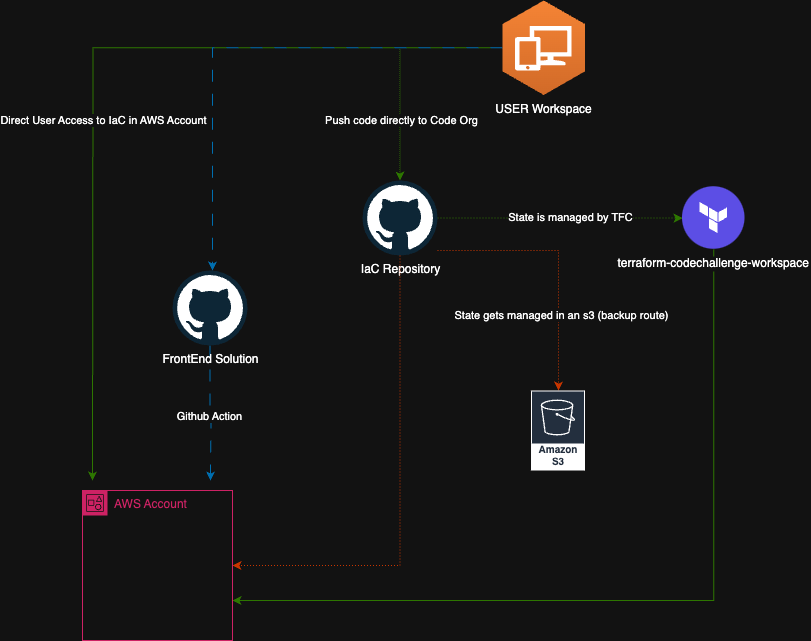

# Welcome to the Guidehouse Hackathon Template

## Pre-requisites

Welcome to the Guidehouse Hackathon! We are excited to have you on board and look forward to seeing the amazing projects you will be working on. Before we get started, we would like to provide you with some information on how projects are operated within the Guidehouse Hackathon.

1. **`Tools`**:
    - `AWS Workspaces`: You will be provided with an AWS workspace to work on your project.
      - This workspace will be used to deploy your infrastructure and applications.
    - `AWS IAM User`: You will be provisioning your own IAM user to deploy infrastructure to your assigned AWS account.
    - Terraform Cloud: You will be provisioning & configuring your own Terraform Cloud organization & workspace to deploy your infrastructure.
  
2. **`Project Management`**:
   - **Project Lead**: The project lead is responsible for the overall project management and ensuring that the project is completed on time.
     - **Jira**: You will be provided with Jira access to host your project on a board.

3. **`Language`**:
    - **Terraform**: Infrastructure as Code (IaC) tool used to deploy infrastructure.
    - **Terraform Cloud**: Tool used to manage your Terraform state files.
    - **Remote State**: Location where your Terraform state files will be stored. Main method of storing state files will be in Terraform Cloud. If you are using AWS, you can also use S3 if required.
    - **Github**: Version control system used to store your project code.
    - **Github Actions**: Used to automate your CI/CD pipeline.
    - **Slack**: Used for communication and collaboration with your team.
    - **Jira**: Used to store project documentation.
    - **Iac-hackathon-template**: This repository is a template for your project. You will be able to fork this repository and update the required information.

4. **`User Workflow Architecture`**
   - 

## Getting Started

The purpose of this guide is to get you deploying infrastructure as soon as possible.

1. Update the prebuilt [README.md](./docs/README.md) Which once you have completed filling out the required information, it expects you to copy and paste the contents into the README.md file in the root of your project.
    - For ease, a copy has been provided below.
    - Required to update:
        - Project Name
        - Add a project desc
        - Project Team members
        - Provide a project architecture approved by CMR
        - Infrastructure Solution Documentation
  
    ```markdown
    # hackathon-iac-template (Change for Project Name)

    ## Project Description

    > small paragraph explaining the project & purpose of repo
    > please add high level details.

    ## ****Project Team****

    | Name/Role        | Email                          |
    | ---------------- | ------------------------------ |
    | Jane Doe - Project Lead           | jdoe@guidehouse.com         |
    | John Smith - Project memeber      | jsmith@guideheouse.com      |

    ### Architecture

    
    ```

2. Update the CODEOWNER file to make the project Tech Lead (and others they delegate) code reviewer on the project .

3. Update the [versions.tf](./terraform/environments/dev/variable.tf) in the `terraform/environments/dev/variable.tf`
    - For ease, a copy has been provided below.
    - An image has also been provide to facilitate where these values are found.
    

        ```Guidehouse Hackathon
        # Configure Guidehouse Hackathon remote state
        # This section of the provider will help set up
        # access to workspace environment variables
        Guidehouse Hackathon {
        backend "remote" {
            organization = "Guidehouse Hackathon organization name" 

            workspaces {
            name = "Guidehouse Hackathon workspace name"
            }
        }
        }
        ```

4. Scoped IAM User for IaC deployment
   1. **IaC Lead : Point of Contact whom will have a dedicated iam user that will be provisioning infrastructrue through terraform cloud and will need to set the following variables up**
        - Access keys being for Azure/ AWS:
          - `AWS_ACCESS_KEY_ID`
          - `AWS_SECRET_ACCESS_KEY` (will be kept by the IaC lead )
          - `AWS_REGION``

5. Resources **should** also include tags for the following:
    - `Project` : `Guidehouse Hackathon`
    - `Environment` : `Dev`
    - `Owner` : `Jane Doe`
    - `Team` : `Jane Doe, John Smith`

## Guidehouse Hackathon System Agreement

Based on the information provided and your understanding of our Guidehouse Hackathon, we kindly request your agreement and acknowledgment of the benefits outlined and pre-requisites aforementioned. Upon completion of the requirements described in this file, please drag this file with the checked the boxes provided in this document with an pull request into the [Guidehouse Hackathon Agreement](./docs/Guidehouse Hackathon-Agreement) folder in this repository, indicating your acceptance and signing off on the following items mentioned above.

- [ ] I have updated the README.md file with the required information.
- [ ] I have understood the pre-requisites and requirements for the Guidehouse Hackathon.
- [ ] I have read, understood and how Projects in Guidehouse Hackathon are operated.
- [ ] I have updated the versions.tf file with the required information.

For any questions or concerns please email us at `cse@guidehouse.com`

### Happy Coding! 🎉 - Maria Cabrera (Mai) - Solutions Architect & Platform Engineering Administrator

<!-- snake interactive -->
<p align="center">
  
</p>