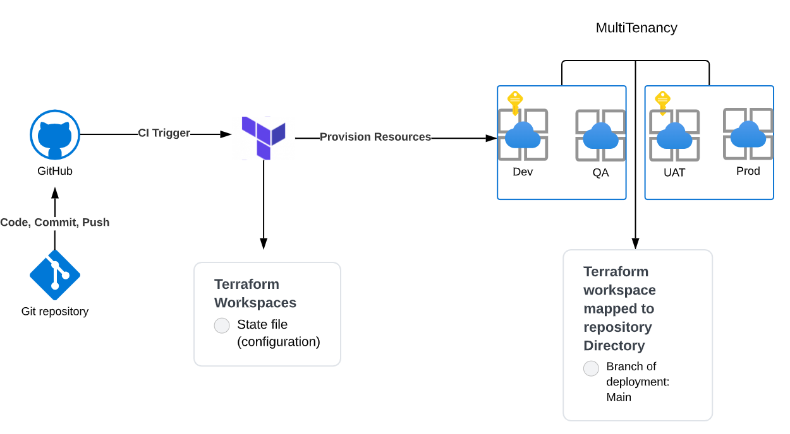
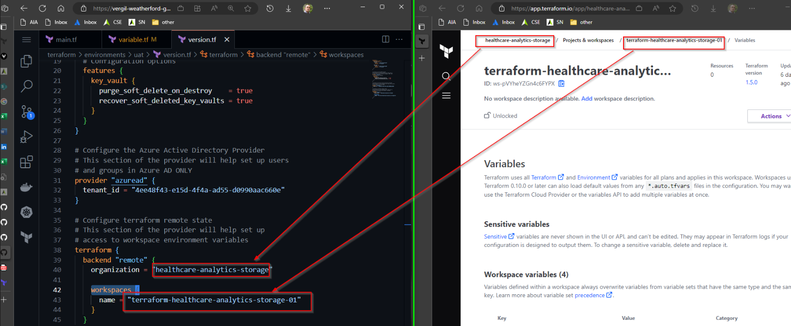

# Welcome to the TERRA Terraform Template

The purpose of this guide is to get you as soon as possible deploying infrastructure.

1. Update the prebuilt [README.md](./docs/README.md) Which once you have completed filling out the required information, it expects you to copy and paste the contents into the README.md file in the root of your project.
    - For ease, a copy has been provided below.
    - Required to update:
        - Project Name
        - Add a project desc
        - Project Team members
        - Provide a project architecture approved by CMR
        - Infrastructure Solution Documentation
  
    ```markdown
    # hackathon-iac-template (Change for Project Name)

    ## Project Description

    > small paragraph explaining the project & purpose of repo
    > please add high level details.

    ## ****Project Team****

    | Name/Role        | Email                          |
    | ---------------- | ------------------------------ |
    | Jane Doe - Project Lead           | jdoe@guidehouse.com         |
    | John Smith - Project memeber      | jsmith@guideheouse.com      |

    ### Architecture

    
    ```

2. Update the CODEOWNER file to make the project Tech Lead (and others they delegate) code reviewer on the project .
3. Read, Understand and how [Projects in TERRA are operated](https://github.com/gh-inner/Guidebook/blob/main/guides/cloud-ops/TERRA/projects-in-TERRA.md)

4. Update the [versions.tf](./terraform/environments/dev/variable.tf) in the `terraform/environments/dev/variable.tf`
    - For ease, a copy has been provided below.
    - An image has also been provide to facilitate where these values are found.
    

        ```terraform
        # Configure terraform remote state
        # This section of the provider will help set up
        # access to workspace environment variables
        terraform {
        backend "remote" {
            organization = "terraform organization name" 

            workspaces {
            name = "terraform workspace name"
            }
        }
        }
        ```

5. Scoped SPN by Provisioned RG
   1. **SRE team: administrated and adds to your workspaces the secrets and access creds, for the time being only the Project Team Lead get a copy of the access keys**
        - Access keys being for Azure/ AWS:
          - `ARM_CLIENT_ID`
          - `ARM_CLIENT_SECRET` (will be kept by the SRE Admins )
          - `ARM_SUBSCRIPTION_ID`
          - `ARM_TENANT_ID`

6. Resources **MUST** (unless an expection is granted through Change management) consume modularized resources available by the Terraform Private Registry which is connected to the associated workspaces.

7. Ensure to always bring in SD-Servers, SD-SEAS, SD-Networks when needing support using PaaS services under the `TERRA` system.

## TERRA System Agreement

Based on the information provided and your understanding of our TERRA, we kindly request your agreement and acknowledgment of the benefits outlined and pre-requisites aforementioned. Upon completion of the requiremnets this file, please drag this file with the checked the boxes provided in this document with an pull request into the [TERRA Agreement](./docs/TERRA-Agreement) folder in this repository, indicating your acceptance and signing off on the following items mentioned above.

- [ ] I have updated the README.md file with the required information.
- [ ] I have updated the CODEOWNER file to include the Tech Lead as a code reviewer.
- [ ] I have read, understood and how Projects in TERRA are operated.
- [ ] I have updated the versions.tf file with the required information.


For any questions or concerns please email us at `cse@guidehouse.com`

### Happy Coding! 🎉 - Mai (Architect & Platform Engineering Administrator)

<!-- snake interactive -->
<p align="center">
  
</p>